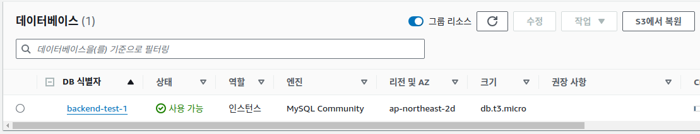
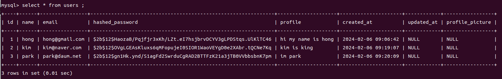
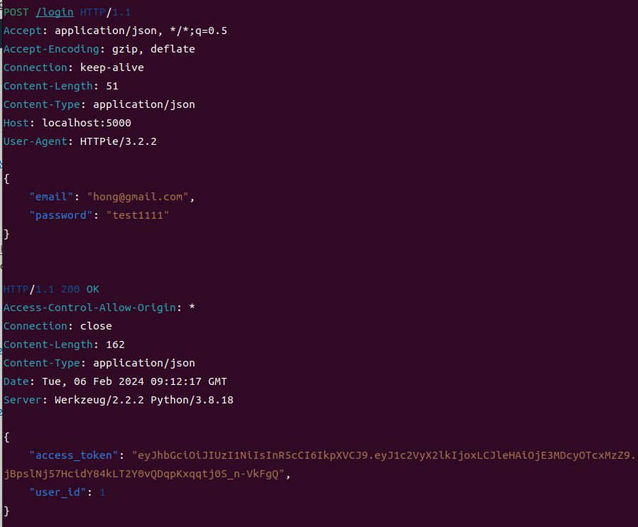

# 백엔드 개발 프로젝트
- Flask와 MySQL을 사용한 미니 SNS 서비스 개발
   - <깔끔한 파이썬 탄탄한 백엔드> 참고

## 1. 서비스 개요
- 회원가입, 로그인, 텍스트 전송, 좋아요, 팔로우, 타임라인, 프로필 사진 전송 기능을 갖춘 미니 sns 서비스

## 2. 서비스 구조
- Flask 프레임워크를 사용한 REST API 기반의 HTTP 요청, 응답 방식의 서비스 구현
- 레이어드 아키텍쳐 방식으로 view, service, model 레이어를 구분하고 각각 엔드포인트, 서비스의 로직, 데이터 베이스를 실행하도록 설계
- SNS 서비스의 특성상 테이블 간의 관계성이 중요하므로 RDBMS 방식의 MySQL을 사용
- AWS의 RDS와 S3에 각각 텍스트 데이터와 이미지 데이터를 저장하고 EC2 가상서버를 사용하여 서비스 배 

## 3. 디렉토리 구조

## 4. 소스코드 설명

### 1) 실행 로직
- setup 파일에서 AWS의 EC2 가상서버에서 api를 실행하기 위해 Twisted 모듈을 사용하여 app 객체를 연결
- config 파일에서 DB 접속 정보를 연결, app 파일에서 view, service, model 레이어를 연결
- view 파일에 각 엔드포인트 구현, service 파일에서 엔드포인트에서 요청에 대한 로직 실행, model 파일에서 DB 처리 요청에 응답

### 2) 엔드포인트
- ping, login, follow, unfllow, tweet, like tweet, timeline, profile image save, profile image download 엔드포인트를 생성하여 서비스의 기능을 구현

### 3) 로그인 인증
- bcrypt 패키지를 사용하여 로그인 비밀번호를 해쉬 암호화 하여 DB에 저장
- pyJWT 패키지를 사용하여 로그인 정보를 담은 json 데이터를 access token으로 변환 후 엔드포인트마다 access token을 인증하도록 데코레이터 함수 적용

### 4) 데이터 베이스
- SQLAlchemy를 사용하여 DB를 구축하고 MySQL을 사용하여 데이터 베이스 생성, 조회 
- users, tweets, like_tweet_list, user_follow_list 4개의 테이블을 생성하고 각 테이블을 user_id 컬럼을 외부키로 연결
- 이미지 데이터의 path를 DB에 저장할 때 werkzeug의 secure_filename 매서드를 사용하여 path에 로컬 시스템의 로직이 노출되지 않도록 보안이 강화된 path로 변환하여 사용

### 5) 데이터 관리
- message, like, follow, unfollow 데이터는 MySQL DB의 테이블에서 관리
- profile image 파일은 boto3 패키지를 사용하여 AWS의 S3 서버에서 관리

### 6) AWS 가상서버를 사용한 서비스 배포
- 클라우드에서 서비스를 배포하기 위하여 AWS의 EC2, ALB, RDS, S3, IAM 기능을 사용
- EC2 가상서버 2개를 생성하고 ALB 로드밸런서를 적용하여 라우팅 배분 및 HTTP 트래픽 자동 조정
- 텍스트 데이터의 저장을 위해 RDS DB를 생성하고 MySQL을 적용 후 EC2와 연결
- 이미지 데이터 관리를 위해 CDN(content delivery network) 서비스인 S3 서버를 생성하고 EC2와 연결
- 사용자 권한 관리 서비스인 IAM 적용하여 S3 서버에 공용접근 및 boto3 객체에서 접속 설정
- EC2 가상서버와 GitHub 레포지토리를 deploy key로 연결하여 소스코드 파일 다운로드
- 다운로드한 소스코드를 가상서버 환경에 맞도록 일부 수정 후 서비스 배포

#### AWS EC2

#### AWS RDS

### 7) Unit Test
- pytest 모듈과 flask의 test_client() 함수를 사용하여 각 test 엔드포인트 별로 요청, 응답 일치 테스트
- test 시 DB에서 중복 데이터 오류가 발생하지 않도록 test 전후 자동으로 데이터를 생성하고 지울 수 있는 pytest의 setup_function(), teardown_function() 함수 사용
- S3 서버에 이미지 파일 전송 테스트시 저장공간, 비용 문제를 해결하기 위해 소스코드에서 mock 패키지를 사용하여 가짜 boto3 객체를 만들어 테스트 완료

## 5. 서비스 실행

### 1) ping 송수신 테스트
- ping curl을 보내면 "some some pong" 이라는 메시지를 응답한다.

### 2) sign-up
- 회원가입을 하기 위해서 email, name, password, profile 을 입력해야한다. 
- 회원가입이 완료되면 입력한 정보를 json 형태로 반환한다.

- DB에 저장 된 회원 정보 확인

### 3) login
- 로그인을 하려면 email과 password를 입력하고 request 해야한다. 
- 입력한 회원 정보가 DB에 저장된 정보와 일치하는 지 확인후 일치하면 access_token을 생성하여 반환한다.

### 4) send message
- 로그인 후 tweet 메시지를 보내려면 tweet과 access_token 값을 함께 request에 보내야한다.

- access_token이 DB에 저장된 정보와 일치하면 tweet이 DB의 tweets 테이블에 저장 된다.

### 5) follow
- 다른 아이디를 가진 사용자를 flow 하는 기능으로, 로그인 된 상태에서 follow할 대상의 아이디 값을 reqeust에 보낸다. 이때도 acesse_token 값을 함께 입력한다.

- acesse_token 값이 DB의 정보와 일치하면 follow가 성공하고, users_follow_list 테이블에 저장된다.

### 6) timeline
- 사용자의 tweet과 follow한 사용자의 tweet을 볼 수 있는 타임라인 기능으로, request시 사용자의 모든 tweet을 반환한다.

### 7) profile img upload
- 사용자의 프로필 이미지를 업로드하기 위해 request를 보내면 AWS 클라우드의 저장소에 이미지 파일이 업로드 되고, 동시에 로컬 DB의 users 테이블에 이미지의 AWS url 값이 저장된다.

- DB

- AWS S3

### 8) profile img download
- 프로필 이미지의 AWS 저장소 url을 다운로드 하면 원하는 디렉토리에 저장 할 수 있다. 

